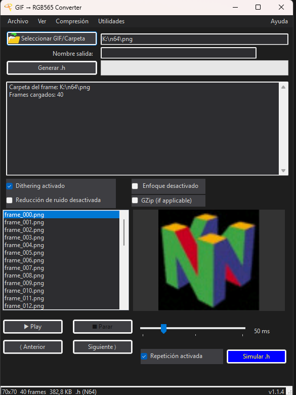
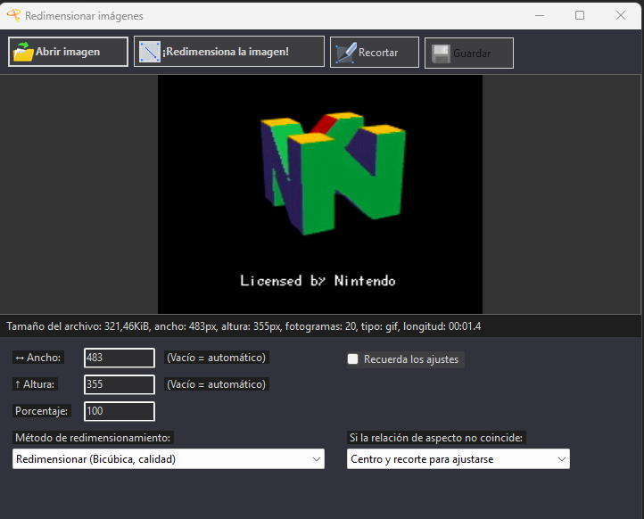
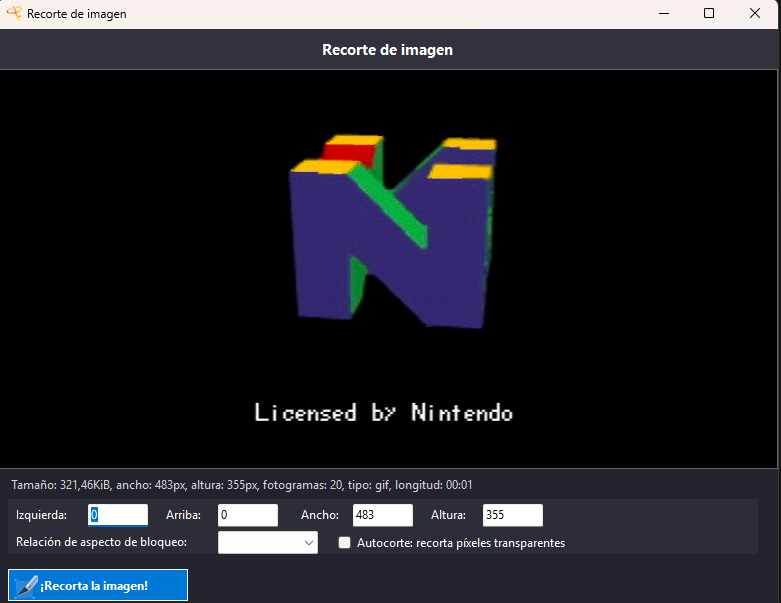

# GifToRGB565

  
  
  

Conversor de GIF / secuencia de imágenes a arrays RGB565 (formato para N64/ESP32) con interfaz gráfica en WinForms.

## Características

### Conversión RGB565
- Cargar GIF animado o carpeta de frames (`.png`, `.jpg`).
- Previsualizar frames y reproducir animación con control de velocidad y loop.
- Generar archivo `n64.h` con los frames convertidos a formato RGB565.
- Exportar binarios para ESP32 (`.bin` y `.bin.gz`).
- Opciones de procesamiento: dithering, noise reduction y sharpen.

### Herramientas de imagen
- **Redimensionar imágenes** (Menú Utilidades → Redimensionar imágenes): formulario dedicado con `Magick.NET` para redimensionar imágenes estáticas y GIFs animados. Soporta coalesce (como ezgif), múltiples filtros (Lanczos, Bilineal, Vecino cercano) y modos de aspect ratio (centrar y recortar, estirar, forzar proporción, relleno transparente).
- **Recortar imágenes** (botón "Recortar"): selección visual por ratón con overlay, campos Izquierda/Arriba/Ancho/Altura sincronizados, autocorte de píxeles transparentes, y relación de aspecto bloqueable. Funciona con imágenes estáticas y GIFs animados.

### Interfaz
- **Barra de estado:** Muestra dimensiones del frame, total de frames, tamaño estimado del output y formato de exportación.
- **Tema oscuro/claro:** Cambio de tema desde Menú → Ver → Tema, con persistencia.
- **Menú "Abierto reciente":** Últimas 5 rutas abiertas (GIFs, carpetas, headers).
- **Drag & Drop:** Arrastra archivos `.gif`, `.png`/`.jpg`, carpetas o headers `.h`/`.txt` directamente a la ventana.
- **Iconos en botones:** Iconos SVG convertidos a PNG 24x24 para los botones principales (redimensionar, recortar, guardar).
- Menú "Archivo" y "Compresión" para seleccionar formato de exportación.
- Barra de progreso y logs durante la conversión.

## Tecnologías
- **.NET 8.0** / WinForms
- **Magick.NET** — procesamiento de imágenes y GIFs animados (resize, crop, coalesce)
- **System.Drawing** — renderizado y conversión RGB565

## Requisitos
- .NET 8
- Visual Studio 2022/2023 u otro IDE compatible con WinForms y .NET 8

## Instalación y uso
1. Clona el repositorio:
   `git clone https://github.com/scorpio21/GifToRGB565.git`
2. Abre la solución `GifRGB565GUI.slnx` en Visual Studio.
3. Restaura paquetes y compila la solución.
4. Ejecuta la aplicación.

## Uso rápido
- Selecciona un GIF animado o una carpeta de frames con `Seleccionar GIF/Carpeta`.
- El panel izquierdo lista los frames; puedes reproducir la animación con `Play` / `Stop`.
- En el menú superior selecciona `Compresión` y elige el formato de exportación:
  - `n64.h (original)` — genera el header `n64.h` en `output/` al pulsar `Generar`.
  - `esp32.bin` — al pulsar `Generar` se pregunta la ruta de salida para un `.bin`.
  - `esp32.bin.gz` — al pulsar `Generar` se pregunta la ruta de salida para un `.bin.gz`.
- Usa el grupo **Rescale** para cambiar la resolución de los frames antes de convertir.
- La barra `GZip (if applicable)` se puede usar para forzar compresión al exportar `.bin`.
- `Simular .h` abre una ventana que reproduce la animación convertida desde RGB565.

### Redimensionar (Utilidades)
1. Menú → Utilidades → Redimensionar imágenes.
2. Arrastra o carga una imagen/GIF.
3. Introduce las dimensiones deseadas o un porcentaje.
4. Selecciona método y relación de aspecto.
5. Pulsa "¡Redimensiona la imagen!" y guarda.

### Recortar
1. En el formulario de redimensionar, pulsa "Recortar".
2. Arrastra sobre la imagen para seleccionar el área de recorte.
3. Ajusta los campos manualmente o bloquea la relación de aspecto.
4. Pulsa "¡Recorta la imagen!".

## Notas
- La barra de progreso se actualiza por cada frame procesado.
- La configuración (nombre de salida, tema, recientes, rescale) se guarda automáticamente en `last_output.json`.
- Los GIFs animados se procesan con `Coalesce()` de Magick.NET para preservar la animación correctamente (igual que ezgif).

## Contribuir
- Abre un _issue_ para reportar errores o proponer mejoras.
- Crea _pull requests_ con descripciones claras de los cambios.

## Licencia
Este proyecto está bajo la licencia MIT. Consulta el archivo `LICENSE` para más detalles.

## Contacto
- Autor: scorpio21 (https://github.com/scorpio21)
